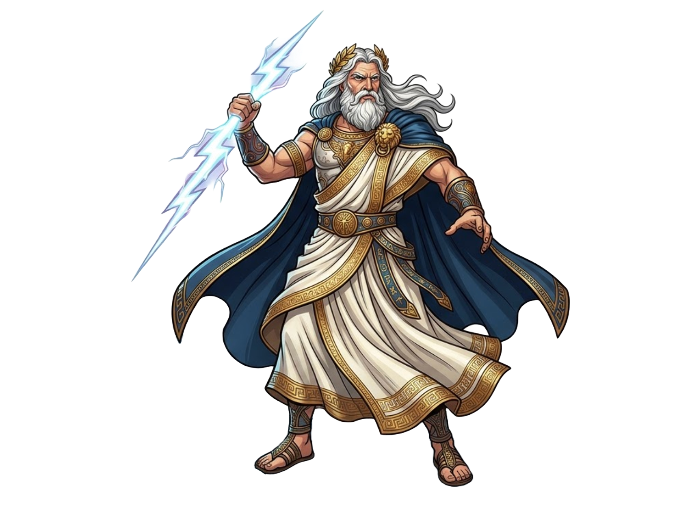

# COMP4020 prototype

This is your starter repo for a COMP4020 prototype. This week's stack is
**bare**: hand-written HTML/CSS/JS, no bundler, no TypeScript in the prototype
source. `pnpm build` (`scripts/build.ts`) just copies the site root into
`dist/` --- there's no separate build step to reason about. (TypeScript stays
for the template's own spec tests in `spec/`, which is infrastructure, not
"the stack".) It deploys to GitHub Pages. The
**deployed site is what gets marked** --- not this repo, and not "it works on
my machine". It's marked live in Chrome against the deployed URL at two
viewports --- 1920×1080 (desktop) and 390×844 (phone) --- and both count in
full, so make that artefact good at both and use the checks below to know
whether it is.

What you're building this week — the spec — is published on the course website,
and this repo's name tells you which deliverable it is. Run the course plugin's
**start** skill at the start of each week: it pulls the right spec from the
course API, carries your harness forward from last week, and helps you turn the
spec's checkable lines into tests of your own. Read the spec before you build,
and see `spec/README.md` for how the checks in this repo relate to it.

## How to work in here

- Keep the dev server running (`pnpm dev`) so you see changes as you make them.
- Before you push, run `pnpm check`. It runs most of what CI runs --- build,
  lint, and the spec --- so you catch those in seconds instead of waiting for
  the pipeline. The links check, the evidence check, the secrets scan, and the
  deploy itself only run in CI; run `pnpm dlx linkinator ./dist --silent`
  locally against a fresh `pnpm build` for the links check without waiting for
  CI.
- To see what the page actually looks like rather than what you assume it looks
  like, open it in a browser (the `agent-browser` CLI, documented on
  [the course site](https://comp.anu.edu.au/courses/comp4020-agentic-coding-studio/topics/backpressure/#agent-browser-the-rendered-page-as-ground-truth),
  works well for this). The rendered page is the truth; your mental model of it
  isn't.
- When a check fails, read its output before changing anything. Each check below
  names what it measures, and the failure message is the instruction: it tells
  you the file, the line, or the contract. Treat a red check as authoritative
  --- the page is wrong until the check is green, not until you decide it should
  be.
- Commit when the checks pass. Never commit a red state.

## The checks (your sensors)

CI runs these on every push once your repo is public. GitHub's checks UI shows
two jobs, `check` and `deploy` --- not one status per sensor below --- and
within `check` the steps run in sequence (`pnpm check` chains typecheck, build,
lint, and the spec with `&&`), so an early failure like a broken build stops the
later sensors from running for that push; fix it and push again to see the rest.
While the repo is private (all week, until you ship) the CI jobs stay skipped
--- `pnpm check` is the same roster on your machine, and it's the faster loop
anyway. They aren't hoops. Each is a different way of finding out something true
about the site that you can't reliably see by looking at it.

They also carry a mark at a crit: the sweep runs fifteen minutes after your
cutoff, and green checks there are worth half that week's shipped mark. Still
running counts as not green, so ship with time for CI to finish.

- **typecheck** --- `tsc --noEmit` runs first in `pnpm check`, so a type error
  stops the roster before the build even starts. The types are extra
  backpressure: a red here is the compiler telling you a claim in the code is
  false.
- **build** --- the site must build (`pnpm build`). A build failure means the
  deployed site is broken or stale, so nothing else matters until this is green.
- **deploy / online** --- the live GitHub Pages URL must load and return the
  page you expect. An asset that 404s on the deployed URL counts as broken even
  if it loads locally.
- **spec** --- `spec/invariants.test.ts` asserts what's true of any good
  website, whatever the week's brief asks; the tests you write for the week's
  own spec run alongside it (any `spec/*.test.ts`). A failure names the contract
  you haven't met yet.
- **lint** --- `stylelint` for CSS, `oxlint` for TypeScript. Flags code that's
  wrong, fragile, or non-idiomatic. Read the rule it names.
- **tests** --- any other tests you write, wherever you put them (co-located
  with your source is fine, not just `spec/`), must pass. Vitest picks up both
  this and the spec suite in one `vitest run`, the last step of `pnpm check`. A
  failing test is a claim about the site that's no longer true.
- **evidence** (`pnpm check:evidence`) --- checks your process evidence:
  `PROCESS.md`'s citations resolve to real commits, the current deliverable's
  exact reflection is in `reflections/` (worked out from this repo's name
  against the public course API), and your `CLAUDE.md` is present. Evidence
  gates the deploy --- `deploy` needs `check` to pass, so failing evidence
  blocks the deploy alongside everything else. See
  [Your process is part of the mark](#your-process-is-part-of-the-mark) below,
  and the course website's
  [assessment page](https://comp.anu.edu.au/courses/comp4020-agentic-coding-studio/topics/assessment/#what-you-submit)
  for what counts as evidence.
- **links** --- internal links must resolve. A broken link is a dead end you
  didn't mean to ship.
- **secrets** --- the repo is scanned for committed credentials. Never put a
  key, token, or password in a tracked file. If one leaks, rotate it. A local
  pre-commit hook (`.githooks/pre-commit`, installed by `pnpm install`) also
  blocks any commit containing something shaped like an API key --- by the time
  CI sees a key it's already pushed, so the hook is the sensor that matters.

Nothing here measures **accessibility** or **performance** --- wiring those
sensors (`axe-core`, Lighthouse, or whatever you choose) is your work, and later
in the course the spec will ask you to show how you tested both. When you do,
read a green performance result honestly: it's a lab estimate from one run on a
CI machine, not proof the site is fast for real users.

## The stack is swappable

This week it's plain HTML/CSS/JS with no bundler, and every file at the repo
root that isn't template scaffolding is copied straight into `dist/` by
`scripts/build.ts` --- add pages, link them, no config. That's a default, not a
rule (unless the week's spec says otherwise). You can swap in Astro, Vite, or
any other tool, because nothing in CI names
a tool --- the whole contract is:

- `pnpm build` emits the complete site into `dist/`
- the `package.json` scripts (`check`, `check:evidence`, `build`) keep working
- whatever lands in `dist/` still passes the invariants in `spec/`

Two things bite in a swap. The deployed site lives under a path
(`…github.io/<repo>/`), so configure your generator's base path --- this
template's Vite config uses relative asset URLs to sidestep that, but most
generators (Astro included) need `base` set explicitly, and getting it wrong
looks fine locally while every asset 404s on the live URL. And commit the
updated `pnpm-lock.yaml`: CI installs with `--frozen-lockfile`.

## Your process is part of the mark

The deployed page is only half of it. How you got there is marked too: your
commit history, your agent files, and the decisions visible across them. The
checks above can't see any of that, so a person reads it directly --- which
means building legibly is part of building well.

- **Commit as you go.** Small, frequent commits are the record of how the work
  came together, and that record is read, not just the final state. A trail that
  grew alongside the code is the strongest evidence of your process; a single
  dump the night before is the weakest.
- **Keep a process overview** (`PROCESS.md`). A short reading-guide, not an
  essay: what you built, the moments that mattered --- each pointing at a
  commit, a `CLAUDE.md` change, or a prompt and the commit it produced --- and
  where to look in the history. It points a marker at the evidence; it doesn't
  stand in for it, and claims the history doesn't back don't count. The
  `PROCESS.md` in this repo is a template showing the shape and the citation
  format (link text the commit hash or range, target the commit or compare URL);
  `pnpm check:evidence` verifies your citations resolve to real commits before
  you ship. Markers follow those citations and don't trawl the repo for evidence
  you didn't cite.
- **Write your reflection in `reflections/`** --- a short markdown file in this
  repo, named for the deliverable it answers, so the number in the filename is
  the number in this repo's name (`crit-1.md` in `comp4020-crit1-<you>`,
  `assignment-1.md` in `comp4020-ass1-<you>`); `reflections/README.md` has the
  full rule. `pnpm check:evidence` checks the exact current name against the
  course API, not merely the presence of any well-named file. It answers the two
  standing prompts: the breakthrough that moved the work forward, and what this
  work changed about the developer you want to be. It stays out of the deployed
  site. It's due at the cutoff, and if it isn't in the repo by then the week
  doesn't count as shipped, however good the prototype is.
- **This file is process evidence.** The harness you build to direct the agent,
  this `CLAUDE.md` and any `AGENTS.md`, is itself read as part of how you
  worked. Keep it honest and current (see below).

You don't need a name, a student number, or any identity file in the repo: we
know whose repo it is. Spend the effort on the work.

## This file is yours

This CLAUDE.md is a starting point, not a fixed rulebook. As you learn what your
prototype needs --- a convention to hold the agent to, a sensor that keeps
catching you out, a fact about the stack the agent keeps getting wrong --- write
it down here. Growing this file is the work of harness engineering, and the gap
between this boilerplate and your own version is part of what your prototype
says about the developer you're becoming.

---

# Project Context (Protected)

Everything below is this project's own permanent context, layered on top of
the course boilerplate above (which stays as-is — it describes the checks and
process rules every COMP4020 prototype shares). Treat this section as a
constitution: stable facts and standing decisions, not a place to make an
implementation detail easier by rewriting the rule. **If a future request
conflicts with something below, say so explicitly before changing it — don't
silently rewrite a protected decision.**

## Project Identity

A COMP4020 Assignment 1 prototype: a single-page, vertical-scroll journey
through the Twelve Olympians (plus Hades), built as a bare static site
(`index.html` / `styles.css` / `main.js`, no bundler, no framework).

## Core Concept

The visitor scrolls down through nine "realms" of Greek & Roman myth, from
Olympus down to the Underworld. Scroll position is the core interaction: it
drives a realm indicator, per-realm background parallax, and the entrance of
each realm's god artwork. A secondary interaction — hovering or keyboard-
focusing a god's figure — reveals that god's longer story.

## Technical Stack

- Plain HTML, CSS, and vanilla JavaScript at the repo root (`index.html`,
  `styles.css`, `main.js`) — no bundler, no framework, no JSX/TSX, no
  component system.
- `scripts/build.ts` copies the repo root into `dist/`, skipping only project
  scaffolding (its `SKIP` set) — there is no compilation step for the site
  itself.
- TypeScript is used only for the template's own spec tests (`spec/*.test.ts`,
  Vitest + JSDOM) and build/evidence scripts — never for the prototype source.
- `pnpm check` runs typecheck, build, `oxlint`, `stylelint`, and `vitest run`.
- Deploys to GitHub Pages; asset paths are relative (`./characters/Zeus.png`,
  `./styles.css`, `./main.js`) so the site works under the Pages subpath.

## Project Structure

```text
index.html         the whole site: header, 9 <section class="realm">, gods
styles.css         all styling — realm backgrounds, layout, animation
main.js            scroll → realm indicator/parallax; hover/focus → story
characters/        13 finished PNG character portraits (source of truth)
scripts/build.ts   copies the site root into dist/ (characters/ included)
spec/              invariants.test.ts + assignment-1.test.ts (Vitest)
reflections/       course-required per-deliverable entries, plus this
                   project's dev-history lessons (reflections/reflections.md)
PROCESS.md         course-required cited process overview + dev workflow
```

## Character Asset System

Character artwork lives in `characters/` as 13 finished PNG files, one per
god, already generated as complete illustrations:

```text
characters/Zeus.png       characters/Athena.png      characters/Poseidon.png
characters/Hera.png       characters/Ares.png        characters/Aphrodite.png
characters/Apollo.png     characters/Demeter.png     characters/Hades.png
characters/Artemis.png    characters/Dionysus.png
characters/Hermes.png     characters/Hephaestus.png
```

Each god uses this consistent markup pattern in `index.html`:

```html
<div class="god-portrait">
  
</div>
```

`.god-portrait` carries the idle float animation; `.god-art` carries sizing,
the hover/focus scale, and drop-shadow — kept on separate elements so the two
transforms never collide.

## Character Asset Rules (Non-Negotiable)

> Character artwork is provided as finished PNG assets and must be used
> directly. The files in `characters/` are the source of truth for what every
> god looks like.

**Never recreate, redraw, simplify, or replace an existing character PNG with
SVG, CSS shapes, icon fonts, emoji, or geometric primitives.** If
`characters/<Name>.png` exists, use `characters/<Name>.png`. This project
tried building characters from SVG twice — first as simple icon-like
silhouettes, then as anatomically-detailed human figures — and both were
replaced by the PNG approach (full history in
`reflections/reflections.md`). Do not revisit either approach.

The website **may**: position, scale, crop-via-`object-fit`, and layer the
PNG; animate it (opacity, transform, filter) via CSS; apply parallax and
scroll-tied entrance/exit; fade or scale it on hover/focus.

The website **must not**: redraw, trace, or approximate the character in SVG
or CSS; alter what the artwork depicts (only presentation); move, rename, or
overwrite files in `characters/`; hide the transparent background behind a
card, avatar circle, or colored box.

## Visual Design Principles

This is an immersive, scroll-based visual journey — not a dashboard, card
grid, icon collection, or character database. Visual hierarchy, in priority
order:

```text
Environment (realm background)
    ↓
Character artwork (large, primary)
    ↓
Scroll storytelling (realm indicator, transitions)
    ↓
Supporting information (name, domain, story text)
    ↓
Minimal UI (skip link, indicator pill)
```

Characters are large, primary visual elements (`.god-art` sized up to
`min(42vw, 520px)` wide / `min(70vh, 620px)` tall, `object-fit: contain`) —
never small icons beside text, never inside generic cards or avatar circles.

## Scroll-Based World Structure

Scroll position is the single interaction driving the experience:
`window.scrollY` / `innerHeight` (in `main.js`) determines the active realm
and sets the `--realm-progress` CSS custom property, a continuous 0→1 value
consumed by CSS for background parallax. `.realm.active` (toggled as the
visitor scrolls) also drives each realm's background opacity and its god
figures' entrance.

## Realm Order

```text
1. Olympus & Sky        → Zeus, Hera
2. Sun & Moon            → Apollo, Artemis
3. Between Realms        → Hermes (solo)
4. Human World & War     → Athena, Ares
5. Earth & Harvest       → Demeter, Dionysus
6. Underground Fire      → Hephaestus (solo)
7. The Sea               → Poseidon, Aphrodite
8. Deep Sea              → no god — atmospheric transition
9. The Underworld        → Hades (solo)
```

This order and these character-realm pairings are a protected decision (see
below) — changing which god appears in which realm, or the realm sequence, is
a mythology/narrative decision, not a routine implementation detail.

## Animation Principles

- `.realm.active` drives each realm's background opacity and each
  `.god-figure`'s fade-in + rise (opacity/transform transition).
- `.god-portrait` carries a continuous idle float (`@keyframes god-float`),
  staggered between paired gods in a realm so they don't move in sync.
- `.god-art` carries the hover/focus scale + glow, kept separate from the
  float so the two transforms don't fight over one element.
- `.parallax` / `.parallax-slow` / `.parallax-mid` / `.parallax-fast` drive
  background-layer depth via `--realm-progress`.
- `@media (prefers-reduced-motion: reduce)` disables all of the above:
  parallax, particles, the float loop, and the fade/rise transition all
  collapse to a static, fully-visible state.

## Component Architecture

There is no component framework. Each god is a hand-written, structurally
identical block in `index.html`:

```html
<article class="god-figure" data-god="zeus" data-testid="god-card" tabindex="0" aria-expanded="false">
  <div class="god-portrait"></div>
  <h3 class="god-name">…</h3>
  <p class="god-domain">…</p>
  <p class="god-story" id="story-zeus" hidden>…</p>
</article>
```

`main.js` wires hover/focus on every `.god-figure` to toggle `aria-expanded`
and reveal `.god-story`. Do not introduce a JS-templated/injected version of
this markup: `spec/invariants.test.ts` parses the built HTML statically
(JSDOM, no script execution) and would not see script-injected `` tags,
breaking the alt-text invariant. Keep new gods/sections as hand-written HTML
following this exact structure.

## Responsive Design Principles

- Two fixed marking viewports: 1920×1080 (desktop) and 390×844 (phone) — both
  must look correct.
- `@media (width <= 40rem)` re-tunes `.god-figure` max-width and `.god-art`'s
  bounding box so characters stay large on phone screens, not shrunk to icon
  scale.
- `.realm-gods` uses `flex-wrap` so two-god realms stack vertically at narrow
  widths rather than compressing illegibly.

## Accessibility Principles

- Every `` has descriptive `alt` text (enforced by
  `spec/invariants.test.ts`) — carry the god's pose/costume description, not
  just their name.
- `.god-figure` is keyboard-reachable (`tabindex="0"`) and reveals its story
  on `focusin`/`focusout` as well as `mouseenter`/`mouseleave`.
- `:focus-visible` gets a visible outline.
- A skip link is present for keyboard/screen-reader users.
- All motion respects `prefers-reduced-motion: reduce`.

## Performance Principles

- No bundler/build step for the prototype source — `dist/` is a straight file
  copy.
- Character images use `loading="lazy"` and `decoding="async"`.
- No JS framework runtime; `main.js` is a small, dependency-free script.

## Non-Negotiable Rules

1. Never recreate, redraw, simplify, or replace a character PNG with SVG, CSS
   shapes, icons, or geometric primitives (see Character Asset Rules above).
2. Every `` must have `alt` text.
3. Don't move, rename, or delete files in `characters/`.
4. Don't commit a red `pnpm check`.
5. Asset paths stay relative (`./…`), not root-absolute, for the GitHub Pages
   subpath deploy.
6. Don't introduce a bundler/framework/component system without flagging the
   conflict first — the bare stack is a deliberate choice for this
   deliverable, not an oversight.

## Protected Project Decisions

These were deliberate calls, not defaults — flag a conflict before changing
any of them:

- **PNG character artwork, not SVG.** Two SVG approaches were tried and
  rejected; see `reflections/reflections.md` for the full history. This is the
  settled architecture, not one option among several.
- **Bare stack (no bundler, no framework)** for this deliverable, per the
  course's "bare" template option.
- **Relative asset URLs**, to survive the GitHub Pages subpath without a
  generator-specific `base` config.
- **The 9-realm order and god-realm pairing** listed above is the current
  intended mythology structure; revising it is a narrative decision, not a
  styling fix.
